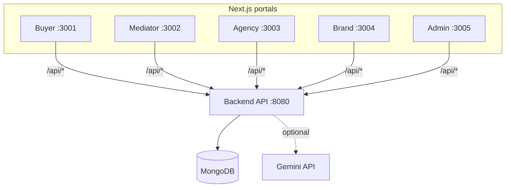
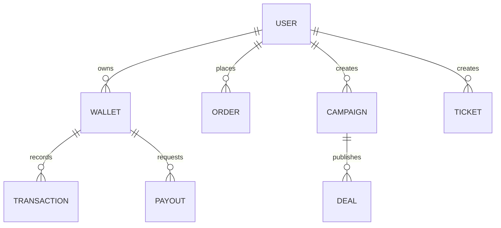

# MOBO

[](../../actions/workflows/ci.yml)

MOBO is a monorepo for a multi-portal commerce + operations system:

- Backend API: Express + TypeScript + MongoDB
- Portals (Next.js): Buyer, Mediator, Agency, Brand, Admin
- Tests: Vitest (backend) + Playwright (E2E)

## System diagram

All portals follow one contract:

- The UI calls `/api/*`
- Each Next app rewrites `/api/*` → `${NEXT_PUBLIC_API_PROXY_TARGET}/api/*`



## Data model (conceptual)



## Repo layout

- `backend/` — Express API, Mongo models, services, seeds, tests
- `apps/buyer-app/` — Buyer portal (dev port 3001)
- `apps/mediator-app/` — Mediator portal (dev port 3002)
- `apps/agency-web/` — Agency portal (dev port 3003)
- `apps/brand-web/` — Brand portal (dev port 3004)
- `apps/admin-web/` — Admin portal (dev port 3005)
- `shared/` — shared utilities/types used by portals
- `e2e/` — Playwright end-to-end tests
- `docs/` — architecture + API + deployment docs

## Docs

- `docs/ARCHITECTURE.md`
- `docs/API.md` (UI contract endpoints)
- `docs/DEPLOYMENT.md` (quick) and `docs/DEPLOYMENT_RENDER_VERCEL_NO_DOMAIN.md` (detailed)

## Prerequisites

- Node.js 20+
- npm 9+

## Quickstart (local)

1. Install

```bash
npm install
```

2. Configure backend env

- Copy `backend/.env.example` → `backend/.env`

For local dev, `MONGODB_URI=<REPLACE_ME>` (the example) uses an in-memory MongoDB.

3. Start everything

```bash
npm run dev:all
```

Ports:

- API: http://localhost:8080
- Buyer: http://localhost:3001
- Mediator: http://localhost:3002
- Agency: http://localhost:3003
- Brand: http://localhost:3004
- Admin: http://localhost:3005

## Environment variables

Backend (`backend/.env`):

- `NODE_ENV`, `PORT`
- `MONGODB_URI`
- `JWT_ACCESS_SECRET`, `JWT_REFRESH_SECRET` (in production: real secrets, >= 20 chars)
- `CORS_ORIGINS`
- `GEMINI_API_KEY` (optional)

Portals:

- `NEXT_PUBLIC_API_PROXY_TARGET` (defaults to `http://localhost:8080`)

Examples:

- Root: `.env.example`
- Per-app: `apps/*/.env.local.example`

## Testing

Run everything:

```bash
npm test
```

Or backend only:

```bash
npm run test:backend
```

Notes:

- Playwright starts a safe E2E backend + all portals automatically.
- E2E uses deterministic seeding and does not require a real MongoDB.

## Cleanup

To remove generated artifacts (build outputs, caches, Playwright traces):

```bash
npm run clean
```

Details and safe deletion criteria: `docs/CLEANUP.md`.

## Deployment

- Backend: Render (or any Node host)
- Portals: Vercel (or any Next host)

Start here:

- `docs/DEPLOYMENT.md`
- `docs/DEPLOYMENT_RENDER_VERCEL_NO_DOMAIN.md`

## Troubleshooting

- CORS: ensure `CORS_ORIGINS` includes your portal origins.
- Wrong backend URL: set `NEXT_PUBLIC_API_PROXY_TARGET`.

## Repo hygiene

See `PUSH_CHECKLIST.md` for a pre-push checklist.
