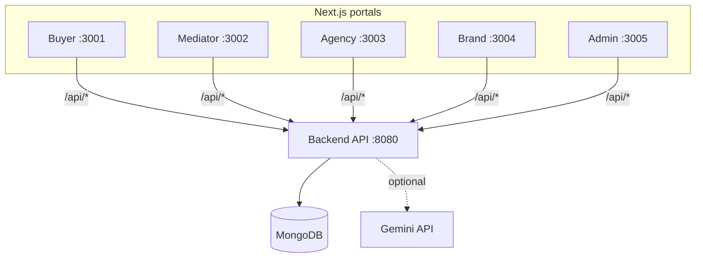
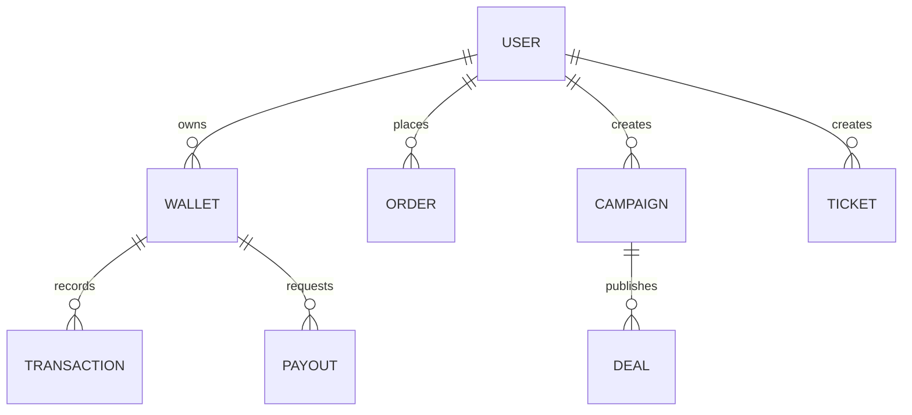

# BUZZMA ECOSYSTEM version 1.0

[](../../actions/workflows/ci.yml)

BUZZMA is a monorepo for a multi-portal commerce + operations system:

- Backend API: Express + TypeScript + MongoDB
- Portals (Next.js): Buyer, Mediator, Agency, Brand, Admin
- Tests: Vitest (backend) + Playwright (E2E)

## System diagram

All portals follow one contract:

- The UI calls `/api/*`
- Each Next app rewrites `/api/*` `${NEXT_PUBLIC_API_PROXY_TARGET}/api/*`



## Data model (conceptual)



## Repo layout

- `backend/` Express API, Mongo models, services, seeds, tests
- `apps/buyer-app/` Buyer portal (dev port 3001)
- `apps/mediator-app/` Mediator portal (dev port 3002)
- `apps/agency-web/` Agency portal (dev port 3003)
- `apps/brand-web/` Brand portal (dev port 3004)
- `apps/admin-web/` Admin portal (dev port 3005)
- `shared/` shared utilities/types used by portals
- `e2e/` Playwright end-to-end tests
- `docs/` architecture + API + deployment docs

## Docs

- `docs/ARCHITECTURE.md`
- `docs/API.md` (UI contract endpoints)
- `docs/DEPLOYMENT.md` (quick) and `docs/DEPLOYMENT_RENDER_VERCEL_NO_DOMAIN.md` (detailed)

## Prerequisites

- Node.js 20+
- npm 9+

## Quickstart (local)

1. Install

```bash
npm install
```

2. Configure backend env

- Copy `backend/.env.example` `backend/.env`

For local dev, `MONGODB_URI=<REPLACE_ME>` (the example) uses an in-memory MongoDB.

3. Start everything

```bash
npm run dev:all
```

Ports:

- API: http://localhost:8080
- Buyer: http://localhost:3001
- Mediator: http://localhost:3002
- Agency: http://localhost:3003
- Brand: http://localhost:3004
- Admin: http://localhost:3005

## Reset DB (admin only)

This drops the entire MongoDB database (collections + indexes) and then seeds only a single admin user.

1. Set admin seed values in `backend/.env` (recommended) or as environment variables:

- `ADMIN_SEED_USERNAME` (admin login uses username/password)
- `ADMIN_SEED_PASSWORD`
- `ADMIN_SEED_MOBILE` (required by the User model; not used for admin login)
- `ADMIN_SEED_NAME`

2. Confirm the wipe (required safeguards):

- `WIPE_DB=true`
- `WIPE_DB_CONFIRM=WIPE`

If your `MONGODB_URI` is not local, the script will refuse unless you also set:

- `WIPE_DB_ALLOW_REMOTE=true`

3. Run:

```bash
npm run db:reset-admin
```

Windows PowerShell one-liner example (your requested credentials):

```powershell
$env:ADMIN_SEED_USERNAME='chetan'; $env:ADMIN_SEED_PASSWORD='chetan789'; $env:ADMIN_SEED_MOBILE='9000000000'; $env:ADMIN_SEED_NAME='Chetan Admin'; $env:WIPE_DB='true'; $env:WIPE_DB_CONFIRM='WIPE'; npm run db:reset-admin
```

## Environment variables

Backend (`backend/.env`):

- `NODE_ENV`, `PORT`
- `MONGODB_URI`
- `JWT_ACCESS_SECRET`, `JWT_REFRESH_SECRET` (in production: real secrets, >= 20 chars)
- `CORS_ORIGINS`
- `GEMINI_API_KEY` (optional)

Portals:

- `NEXT_PUBLIC_API_PROXY_TARGET` (defaults to `http://localhost:8080`)

Examples:

- Root: `.env.example`
- Per-app: `apps/*/.env.local.example`

## Testing

Run everything:

```bash
npm test
```

Or backend only:

```bash
npm run test:backend
```

Notes:

- Playwright starts a safe E2E backend + all portals automatically.
- E2E uses deterministic seeding and does not require a real MongoDB.

## Cleanup

To remove generated artifacts (build outputs, caches, Playwright traces):

```bash
npm run clean
```

Details and safe deletion criteria: `docs/CLEANUP.md`.

## Deployment

- Backend: Render (or any Node host)
- Portals: Vercel (or any Next host)

Start here:

- `docs/DEPLOYMENT.md`
- `docs/DEPLOYMENT_RENDER_VERCEL_NO_DOMAIN.md`

## Troubleshooting

- CORS: ensure `CORS_ORIGINS` includes your portal origins.
- Wrong backend URL: set `NEXT_PUBLIC_API_PROXY_TARGET`.

## Health & diagnostics

Backend endpoints:

- `GET /api/health` returns API + database readiness.
- `GET /api/health/e2e` is stricter and used by Playwright to confirm the stack is fully ready.

Every response includes an `x-request-id` header. Include that value when reporting issues to correlate logs.

## Repo hygiene

See `PUSH_CHECKLIST.md` for a pre-push checklist.
