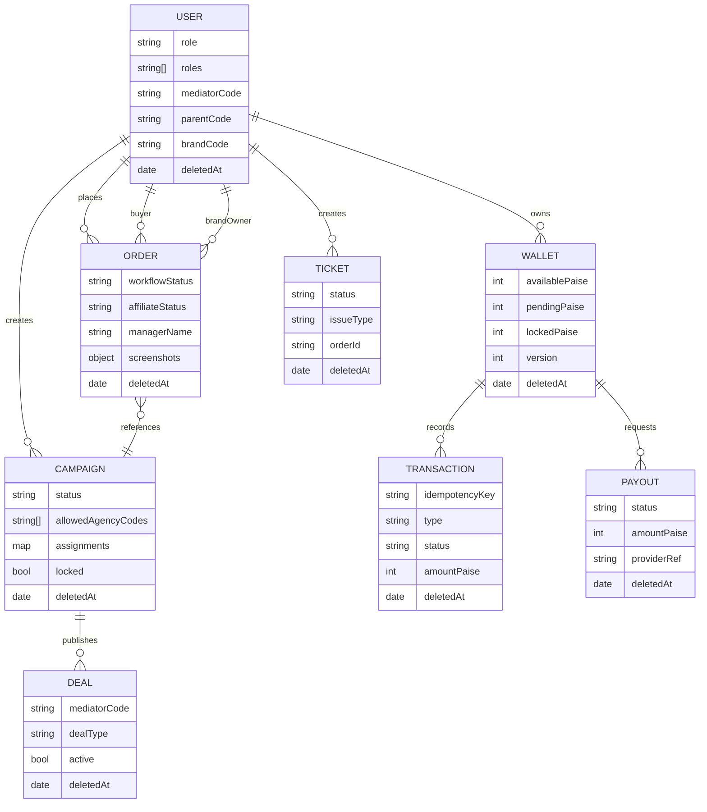

# Architecture

This repo is an npm-workspaces monorepo with:

- 5 Next.js portals under `apps/*`
- An Express + TypeScript + PostgreSQL (Prisma) backend under `backend/`
- A shared package under `shared/`

## High-level system

```mermaid
graph TD
  subgraph Portals[Next.js portals]
    B[Buyer (3001)]
    M[Mediator (3002)]
    A[Agency (3003)]
    BR[Brand (3004)]
    AD[Admin (3005)]
  end

  API[Backend API (Express, 8080)]
  DB[(PostgreSQL)]
  AI[Gemini API]

  B -->|/api/* via Next rewrites| API
  M -->|/api/* via Next rewrites| API
  A -->|/api/* via Next rewrites| API
  BR -->|/api/* via Next rewrites| API
  AD -->|/api/* via Next rewrites| API

  API --> DB
  API -. optional .-> AI
```

## Auth + roles

- JWT bearer auth for most routes.
- Roles are stored in PostgreSQL and validated on every request (zero-trust tokens).
- Upstream suspension enforcement:
  - Buyer access can be blocked if their mediator/agency is not active.
  - Mediator access can be blocked if their agency is not active.

Roles: `shopper`, `mediator`, `agency`, `brand`, `admin`, `ops`.

## Soft-delete rule

All tables implement soft delete:

- Active row means `deletedAt IS NULL`.
- Uniqueness indexes are partial on `deletedAt IS NULL`.

## Core data model (conceptual)



## Money safety (wallet/ledger)

- Wallet updates are done via idempotent transactions (`Transaction.idempotencyKey` has a unique index for non-deleted rows).
- Brand→Agency payouts debit the brand wallet and credit the agency wallet with replay-safe idempotency keys.

## Order workflow

Orders have a strict state machine (`workflowStatus`), with anti-fraud constraints:

- A buyer cannot have more than one active order per deal.
- Some workflows can be frozen (e.g., suspensions) and require explicit reactivation.
